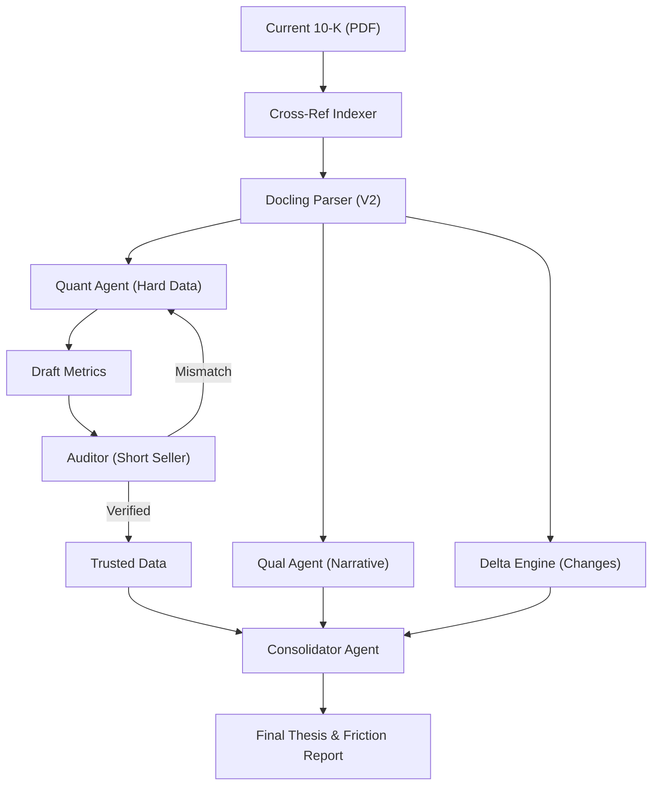

# GVD Engine: Technical Architecture & Workflow Design
**Last Updated:** January 1, 2026

## 1. The Agentic Core
The GVD Engine is built on a multi-agent "Society of Mind" architecture. Each agent has a specific persona, incentive structure, and set of tools.

*   **Originator ("The Scout")**: Scans markets for new ideas. Tool: Sector Search.
*   **Quant ("The Skeptic")**: Extracts hard numbers from documents. Strict adherence to GAAP. Tool: Docling Parser.
*   **Qual ("The Anthropologist")**: Analyzes narrative tone and management sentiment. Tool: Text Analysis.
*   **Auditor ("The Short Seller")**: Adversarial verifier. Incentivized to find errors in the Quant's work. Tool: PyMuPDF Coordinate JUMP.
*   **Consolidator ("The PM")**: Synthesizes conflicting inputs (Data vs Narrative) to form an Institutional Thesis.
*   **LogicGuard ("The Compliance Officer")**: Prevents hallucinations by enforcing mathematical anchors.

---

## 2. Workflow B: Earnings Season (The Institutional Engine)
**Status**: Alpha / Live (Phase 5)

This is the most advanced workflow, designed to ingest complex 10-K PDFs and produce an adversarial audit.

### A. Architecture: "The Fan-Out & Friction Loop"
The system uses an async "Fan-Out" pattern to parallelize extraction and a "Friction Loop" to synthesize findings.



### B. The "Short Seller" Auditor
*   **Goal**: Destroy the Bull Thesis.
*   **Incentive**: +10 Reward for finding an error, 0 for confirming.
*   **Tool**: "Coordinate JUMP". Receives `[x,y,w,h]` and physically reads the PDF at that location to verify the Quant's extraction.

### C. The Strategic Pivot (Phase 5)
Instead of just reporting data, the system evaluates **Thesis Friction**.
*   **Logic**: Compares `Narrative Tone` (e.g., "Bullish") vs `Metric Trends` (e.g., "Revenue Down").
*   **Output**:
    *   **Verdict**: BUY / SELL / CAUTION.
    *   **Conviction Score**: 0.0 - 1.0.
    *   **Friction Analysis**: List of contradictions.

### D. Data Schema (Institutional)
```json
{
  "ticker": "MA",
  "institutional_thesis": {
      "final_verdict": "CAUTION",
      "conviction_score": 0.65,
      "friction_analysis": [
          {"type": "Tone vs Data", "description": "Management is Bullish, but Net Income declined."}
      ]
  },
  "metrics": [
    {
      "metric_id": "revenue",
      "value_raw": 25000000000,
      "provenance": {
        "page_number": 45,
        "bbox": [100.5, 200.0, 50.0, 12.0],
        "source_snippet": "Net revenue ... 25,000"
      },
      "verification": { "status": "verified" }
    }
  ]
}
```

---

## 3. Workflow A: The New Idea Hunt
**Status**: Live
*   **Process**: Use `Originator` to scan a sector (e.g., "BioTech") -> Filter for fundamental strength -> Feed into `ValuationEngine`.
*   **Safety**: `LogicGuard` compares the calculated Target Price vs Current Price. If the upside is unrealistic (>500%), it forces a re-calculation or flags for review.

## 4. Workflow C: Forecasting & Valuation
**Status**: Live
*   **Engine V3**: Implements professional modeling logic.
    *   **10-Year Glide Path**: Linearly interpolates growth rates from `High Growth` to `Terminal Rate`.
    *   **Monte Carlo Drift**: (Optional) Introduces random variance for stress testing.
*   **Output**: Generates a text-based "Analyst Report" justifying the valuation.
